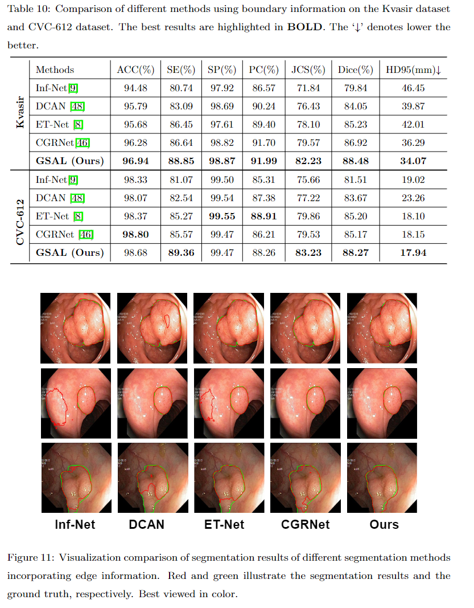

# GSAL：Geometric Structure Adversarial Learning for Robust Medical Image Segmentation 

[](https://opensource.org/licenses/MIT) [](http://makeapullrequest.com)
<!-- TOC -->
This is the official pytorch implementation of the GSAL model:<br />
> **Authors:** 
> Kun Wang,
> Xiaohong Zhang,
> Yuting Lu,
> Wei Zhang,
> Sheng Huang,
> Dan Yang,

## Preface


### 🔥NEWS🔥 :
- [2022/9/24]:fire: Release the other_models (with boundary)  code!
- [2022/4/21]:fire: Release the inference code!
- [2022/1/20] Create repository.


## Requirements
Python 3.7<br />
Torch==1.1.0<br />
Torchvision==0.4.0<br />
scipy (1.5.4) <br />
CUDA 10.0<br />

## Usage

###  Installation
* Clone this repo
```
git clone https://github.com/DLWK/GSAL.git
cd GSAL
```
### Data Preparation
 + Download dataset from following [URL](https://drive.google.com/file/d/17Cs2JhKOKwt4usiAYJVJMnXfyZWySn3s/view?usp=sharing)


###  Comparison with Other Segmentation Models using Boundary Information
<p align="center">
     <br />
    <em> 
    </em>
</p>


