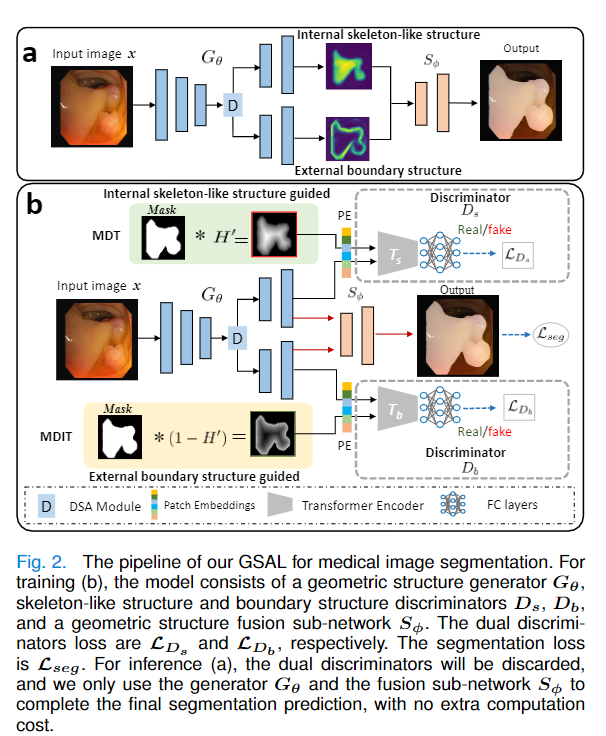
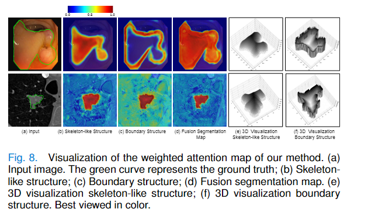
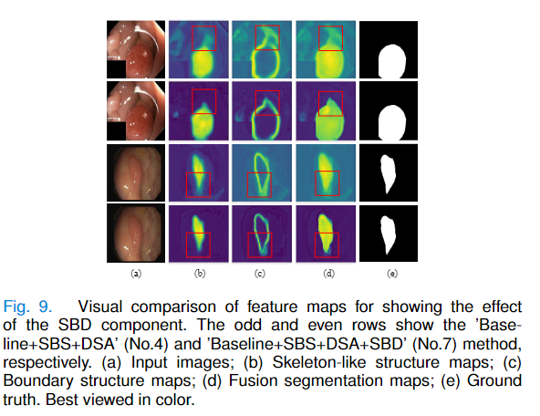

# Geometric Structure Adversarial Learning for Medical Image Segmentation (GSAL)

This is the official pytorch implementation of the GSAL model:<br />

## Preface


### 🔥NEWS🔥 :
- [2022/1/21]:fire: Release the inference code!
- [2022/1/20] Create repository.


## Requirements
Python 3.7<br />
Torch==1.1.0<br />
Torchvision==0.4.0<br />
scipy (1.5.4) <br />
CUDA 10.0<br />

## Usage

### 0. Installation
* Clone this repo
```
git clone https://github.com/DLWK/GSAL.git
cd GSAL
```
### 1. Data Preparation
 + Download dataset from following [URL](https://drive.google.com/file/d/17Cs2JhKOKwt4usiAYJVJMnXfyZWySn3s/view?usp=sharing)
### 2. Overview framework
<p align="center">
     <br />
    <em> 
    </em>
</p>

### 3. Visualization Results
<p align="center">
     <br />
    <em> 
    </em>
</p>

<p align="center">
     <br />
    <em> 
    </em>
</p>
